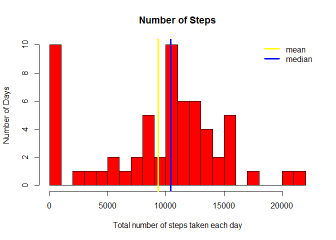
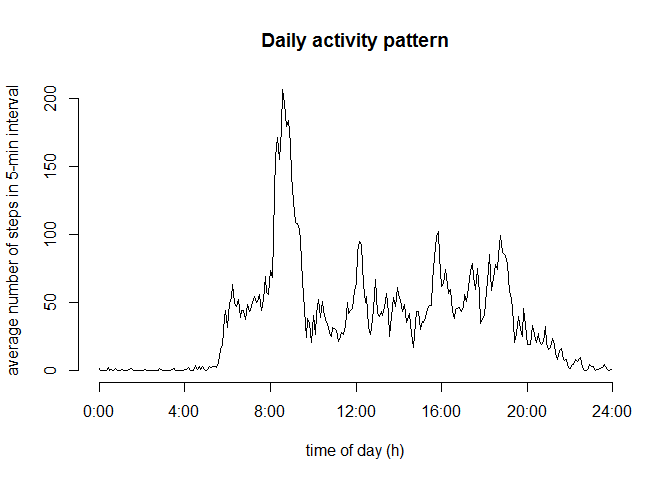
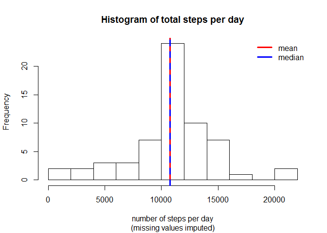
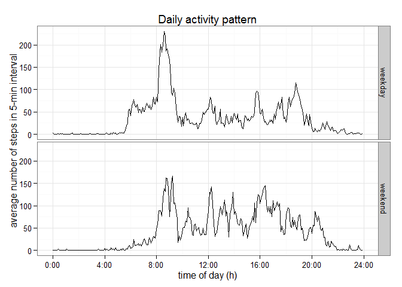

# Reproducible Research: Peer Assessment 1

```r
rm(list=ls())

library(dplyr)
```

```
## 
## Attaching package: 'dplyr'
## 
## The following objects are masked from 'package:stats':
## 
##     filter, lag
## 
## The following objects are masked from 'package:base':
## 
##     intersect, setdiff, setequal, union
```

```r
library(ggplot2)
library("knitr")
opts_chunk$set(echo=TRUE)
```


## Loading and preprocessing the data

```r
setwd ("M:\\Pallavi\\DataScience\\RepResearch\\Week2\\Assn\\RepData_PeerAssessment1\\")
data <- read.csv("activity\\activity.csv")

data$interval <- 60*floor((data$interval+1)/100) + (data$interval %% 100)

str(data)
```

```
## 'data.frame':	17568 obs. of  3 variables:
##  $ steps   : int  NA NA NA NA NA NA NA NA NA NA ...
##  $ date    : Factor w/ 61 levels "2012-10-01","2012-10-02",..: 1 1 1 1 1 1 1 1 1 1 ...
##  $ interval: num  0 5 10 15 20 25 30 35 40 45 ...
```

## What is mean total number of steps taken per day?

```r
dataDT <- group_by(data, date)
dataDT <-  summarise(dataDT, total=sum(steps, na.rm = TRUE))

mean <- mean(dataDT$total)
median <- median(dataDT$total)


hist(dataDT$total, breaks = 20, main="Number of Steps", 
     xlab="Total number of steps taken each day", ylab = "Number of Days", col="red")
abline(v=mean, col="yellow", lwd=3)
abline(v=median, col="blue", lwd=3)

legend(x="topright", legend=c("mean","median"), col=c("yellow","blue"), bty="n", lwd=3)
```

 


## What is the average daily activity pattern?


```r
avg_steps <- tapply(data$steps, data$interval, mean, na.rm=T)

hours <- as.numeric(names(avg_steps))/60
plot(hours, avg_steps, type="l", axes=F,
     xlab="time of day (h)", ylab="average number of steps in 5-min interval",
     main="Daily activity pattern")
axis(2)
axis(1, at=0:6*4, labels=paste(0:6*4,":00", sep=""))
```

 

```r
max_act_num <- which(avg_steps==max(avg_steps))
max_act_int <- data$interval[max_act_num]
sprintf("%02d:%02d", floor(max_act_int/60), max_act_int %% 60)
```

```
## [1] "08:35"
```


## Imputing missing values

```r
sum(is.na(data))
```

```
## [1] 2304
```

```r
impute <- transform(data, steps=ifelse(is.na(steps), avg_steps, steps))

summary(impute)
```

```
##      steps                date          interval     
##  Min.   :  0.00   2012-10-01:  288   Min.   :   0.0  
##  1st Qu.:  0.00   2012-10-02:  288   1st Qu.: 358.8  
##  Median :  0.00   2012-10-03:  288   Median : 717.5  
##  Mean   : 37.38   2012-10-04:  288   Mean   : 717.5  
##  3rd Qu.: 27.00   2012-10-05:  288   3rd Qu.:1076.2  
##  Max.   :806.00   2012-10-06:  288   Max.   :1435.0  
##                   (Other)   :15840
```

```r
total_impsteps <- tapply(impute$steps, impute$date, sum, na.rm=T)

impstep_mean <- mean(total_impsteps)
impstep_mean
```

```
## [1] 10766.19
```

```r
impstep_median <- median(total_impsteps)
impstep_median
```

```
## [1] 10766.19
```

```r
hist(total_impsteps, breaks=11, 
     xlab="number of steps per day", 
     sub="(missing values imputed)",
     main="Histogram of total steps per day")
abline(v=impstep_mean, col="red", lwd=3)
abline(v=impstep_median, col="blue", lwd=3, lty=2)
legend(x="topright", legend=c("mean","median"), col=c("red","blue"), bty="n", lwd=3)
```

 

```r
sum(data$steps, na.rm=TRUE)
```

```
## [1] 570608
```

```r
sum(impute$steps)
```

```
## [1] 656737.5
```


## Are there differences in activity patterns between weekdays and weekends?


```r
Sys.setlocale("LC_TIME", "English") 
```

```
## [1] "English_United States.1252"
```

```r
week <- factor(weekdays(as.Date(impute$date)) %in% c("Saturday","Sunday"), 
               labels=c("weekday","weekend"), ordered=FALSE)

impsteps <- aggregate(impute$steps, by=list(interval=impute$interval, weekday=week), mean)

g <- ggplot(impsteps, aes(interval/60, x))
g + geom_line() + facet_grid(weekday ~ .) +
    scale_x_continuous(breaks=0:6*4, labels=paste(0:6*4,":00", sep="")) +
    theme_bw() +
    labs(y="average number of steps in 5-min interval") +
    labs(x="time of day (h)") +
    labs(title="Daily activity pattern")
```

 
